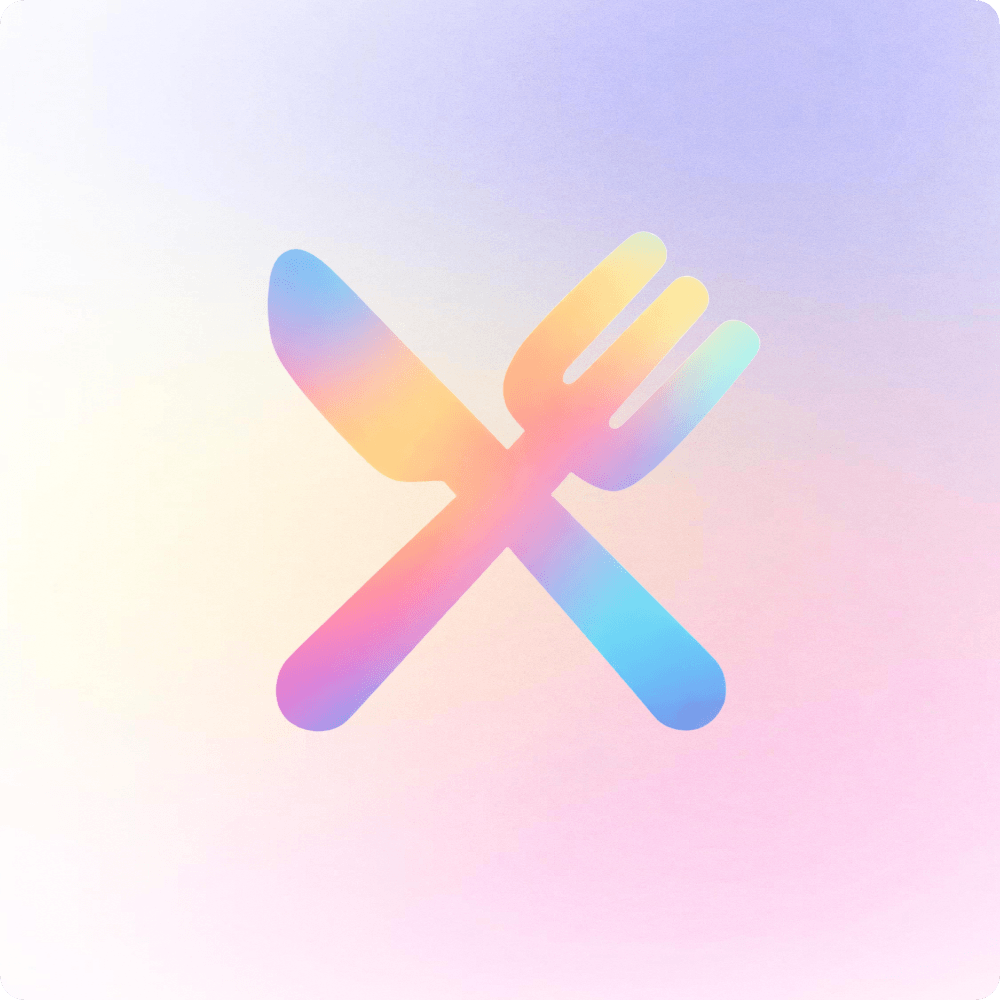
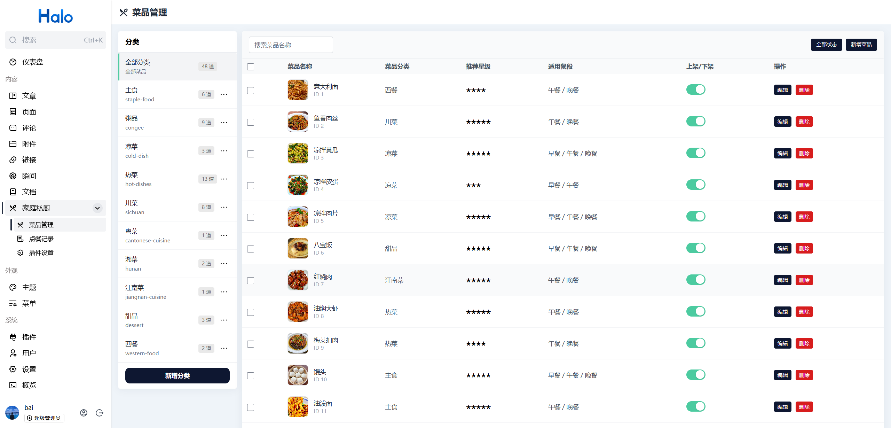
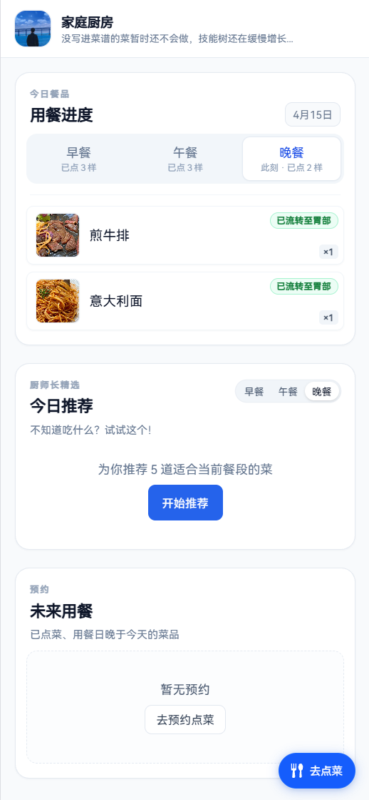

    
    <h1>Halo - Dishes（家庭私厨）</h1>
    
一个面向家庭场景的 Halo 点菜插件

    

        
        
    

## 插件介绍

`Dishes` 是一个基于 Halo 2 的家庭私厨点菜插件，分为后台管理端和前台点菜页两部分：

- 后台：维护分类、菜品、点菜记录、访问与通知设置。
- 前台：按餐段点菜，支持密码访问、推荐与预约场景。

## 功能特性

- 菜品分类管理（新增、编辑、排序、删除）
- 菜品管理（上下架、推荐等级、餐段配置、批量删除）
- 点菜记录管理（按日期查看、明细查看）
- 前台点菜页（早餐/午餐/晚餐、提交备注、预约点餐）
- 访问控制（公开访问/密码访问）
- 消息通知（支持企业微信 webhook 推送）

## 插件预览图

### 管理端

### 前台点菜页

## 使用方式

### 1. 安装插件

在 Halo 应用市场安装，或手动上传本项目构建后的插件包。

### 2. 基础配置

进入 Halo 后台插件设置页，按需配置：

- 访问模式（公开/密码）
- 前台访问路径
- 前台 Logo
- 通知开关与 webhook 地址

### 3. 菜单初始化

依次创建分类与菜品，配置推荐等级、可用餐段与上下架状态。

### 4. 开始使用

打开前台页面进行点菜，可查看历史与预约记录。

## 许可证

[GPL-3.0](./LICENSE)