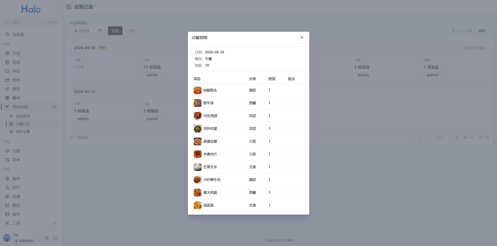
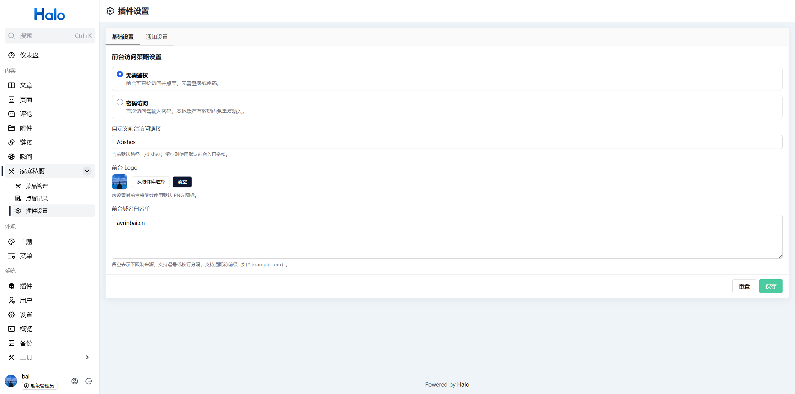
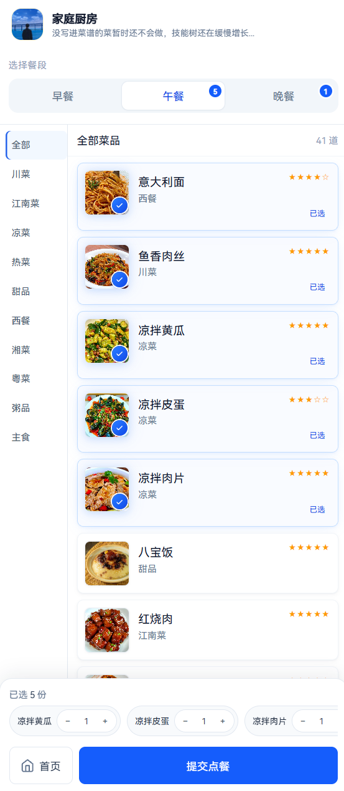

    
    <h1>Halo - Dishes（家庭私厨）</h1>
    
一个面向家庭场景的 Halo 点菜插件

    

    
        
        
    

## 概览

`Dishes` 是一个基于 Halo 2 的家庭私厨点菜插件，包含后台管理端与前台点菜页：

- 后台：维护分类、菜品、点菜记录、访问与通知设置。
- 前台：按餐段点菜，支持密码访问、推荐与预约场景。

## 目录

| 章节 | 说明 |
|------|------|
| [功能亮点](#功能亮点) | 能力列表 |
| [预览图](#预览图) | 界面截图 |
| [快速开始](#快速开始) | 安装、配置、初始化、使用 |
| [独立部署与开发文档](#独立部署与开发文档) | 独立部署、编译构建、Nginx、排错（外链） |
| [许可证](#许可证) | 协议 |

## 功能亮点

- 菜品分类管理（新增、编辑、排序、删除）
- 菜品管理（上下架、推荐等级、餐段配置、批量删除）
- 点菜记录管理（按日期查看、明细查看）
- 前台点菜页（早餐/午餐/晚餐、提交备注、预约点餐）
- 访问控制（公开/密码）
- 消息通知（支持企业微信 webhook 推送）
- 前台展示文案（浏览器标签标题、顶栏主标题与副标题，在插件设置「基础设置」中配置）
- 后台数据备份（ZIP 导出与覆盖式导入）

## 管理端预览

## 前台预览

## 快速开始

### 1) 安装插件

在 Halo 应用市场安装，或手动上传本项目构建后的插件包。

### 2) 基础配置

进入 Halo 后台插件设置页，按需配置：

- 访问模式（公开/密码）
- 前台访问路径
- 前台 Logo
- 前台域名白名单（建议配置，限制可调用前台 API 的来源域名）
- 通知开关与 企业微信机器人 webhook 地址

### 3) 初始化菜单与菜品

依次创建分类与菜品，配置推荐等级、可用餐段与上下架状态。

### 4) 开始使用

打开前台页面进行点菜，可查看历史与预约记录。

---

## 独立部署与开发文档

独立部署（同域 / 独立域名 / 子路径）、环境变量、编译构建、Nginx、上线验证与排错等说明，请查阅：

**[https://avrinbai.cn/docs/dishes/](https://avrinbai.cn/docs/dishes/)**

## 许可证

[GPL-3.0](./LICENSE)
